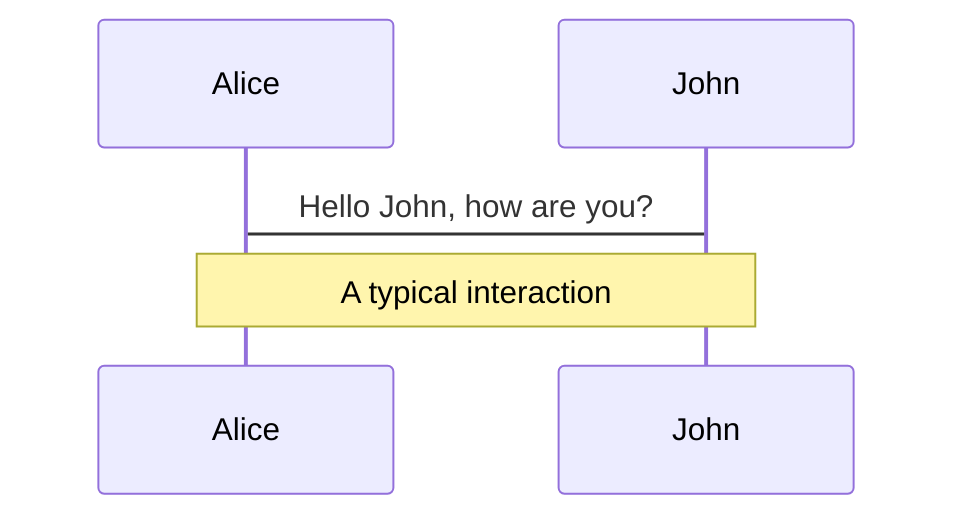
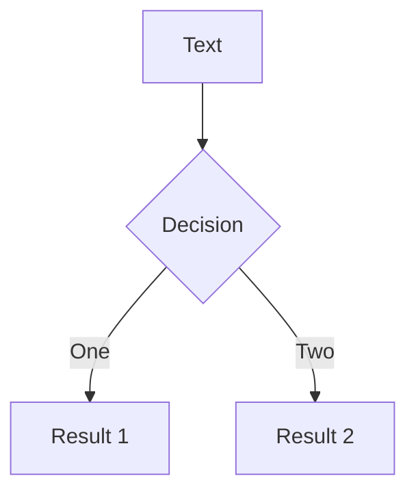

---
# try also 'default' to start simple
theme: Seriph
# random image from a curated Unsplash collection by Anthony
# like them? see https://unsplash.com/collections/94734566/slidev
background: /erik-mclean-za3ADPq8mpo-unsplash.jpg
# apply any windi css classes to the current slide
class: "text-center"
# https://sli.dev/custom/highlighters.html
highlighter: shiki
# some information about the slides, markdown enabled
info: |
  ## Slidev Starter Template
  Presentation slides for developers.

  Learn more at [Sli.dev](https://sli.dev)
---

# React 18 给 SSR 带来的新变化

### By Zach Zhao

<!-- <div class="abs-br m-6 flex gap-2">
  <button @click="$slidev.nav.openInEditor()" title="Open in Editor" class="text-xl icon-btn opacity-50 !border-none !hover:text-white">
    <carbon:edit />
  </button>
</div> -->

<!--
The last comment block of each slide will be treated as slide notes. It will be visible and editable in Presenter Mode along with the slide. [Read more in the docs](https://sli.dev/guide/syntax.html#notes)
-->

---

# API Change

Previously, React did not support Suspense on the server at all. This is changing in React 18, but there are different levels of support depending on which API you use

- 📝 renderToString: Keeps working (with limited Suspense support).
- 🧑‍💻 renderToNodeStream: Deprecated (with full Suspense support, but without streaming).
- 📤 pipeToNodeWritable: New and recommended (with full Suspense support and streaming).

---

# SSR 基本原理

<br/>
<br/>

<div class="flex-row flex items-center mb-10">
<p class="mr-2 w-30">Without SSR:</p>

Rendered<mdi:arrow-right class="text-4xl text-orange-400"/>

</div>

<div class="flex-row flex items-center">
<p class="mr-2 w-30">With SSR:</p>

Hydrated<mdi:arrow-right class="text-4xl text-orange-400"/>

</div>

---

# SSR 阶段分解


<!-- fetch data (server) → render to HTML (server) → load code (client) → hydrate (client) -->

- On the server, fetch data for the <kbd>entire</kbd> app.
- Then, on the server, render the <kbd>entire</kbd> app to HTML and send it in the response.
- Then, on the client, load the JavaScript code for the <kbd>entire</kbd> app.
- Then, on the client, connect the JavaScript logic to the server-generated HTML for the <kbd>entire</kbd> app (this is “hydration”).

---

# SSR 现存问题

- You have to fetch everything before you can show anything

- You have to load everything before you can hydrate anything

- You have to hydrate everything before you can interact with anything

---

# React 18 Alpha 对 SSR 的改进

- Streaming HTML (on the server)

  > To opt into it, you’ll need to switch from <kbd>renderToString</kbd> to the new <kbd>pipeToNodeWritable</kbd> method

- Selective Hydration (on the client)
  > To opt into it, you’ll need to switch from <kbd>ReactDOM.render</kbd> to the new <kbd>ReactDOM.createRoot</kbd> on the client and then start wrapping parts of your app with `<suspense>`

---

# Streaming HTML

<div class="flex flex-row space-x-8">

<div>
```html {all|6-8|all}
<Layout>
  <NavBar />
  <Sidebar />
  <RightPane>
    <Post />
    <Suspense fallback={<Spinner />}>
      <Comments />
    </Suspense>
  </RightPane>
</Layout>
```

```html {all|12|all}
<main>
  <nav>
    <a href="/">Home</a>
  </nav>
  <aside>
    <a href="/profile">Profile</a>
  </aside>
  <article>
    <p>Hello world</p>
  </article>
  <section id="comments-spinner">
    
  </section>
</main>
```

</div>

<div class="flex items-center">

</div>
</div>

---

<div class="flex flex-row space-x-8">
<div class="flex items-center">

```html {all|6-10|all}
<div hidden id="comments">
  <!-- Comments -->
  <p>First comment</p>
  <p>Second comment</p>
</div>
<script>
  document
    .getElementById("sections-spinner")
    .replaceChildren(document.getElementById("comments"));
</script>
```

</div>

<div class="flex items-center">
  
</div>

</div>

---

# Selective Hydration

<div class="flex flex-col space-y-4">
<div class="flex items-center">

```js {all|3|all}
import { lazy } from "react";

const Comments = lazy(() => import("./Comments.js"));

// ...

<Suspense fallback={<Spinner />}>
  <Comments />
</Suspense>;
```

</div>

<div class="flex flex-row space-x-4 items-center">
  
  <mdi:arrow-right class="text-3xl text-orange-400"/>
  
  <mdi:arrow-right  class="text-3xl text-orange-400"/>
  
</div>

</div>

---

# Navigation

Hover on the bottom-left corner to see the navigation's controls panel, [learn more](https://sli.dev/guide/navigation.html)

### Keyboard Shortcuts

|                                                    |                             |
| -------------------------------------------------- | --------------------------- |
| <kbd>right</kbd> / <kbd>space</kbd>                | next animation or slide     |
| <kbd>left</kbd> / <kbd>shift</kbd><kbd>space</kbd> | previous animation or slide |
| <kbd>up</kbd>                                      | previous slide              |
| <kbd>down</kbd>                                    | next slide                  |

<!-- https://sli.dev/guide/animations.html#click-animations -->


<p v-after class="absolute bottom-23 left-45 opacity-30 transform -rotate-10">Here!</p>

---

layout: image-right
image: https://source.unsplash.com/collection/94734566/1920x1080

---

# Code

Use code snippets and get the highlighting directly![^1]

```ts {all|2|1-6|9|all}
interface User {
  id: number;
  firstName: string;
  lastName: string;
  role: string;
}

function updateUser(id: number, update: User) {
  const user = getUser(id);
  const newUser = { ...user, ...update };
  saveUser(id, newUser);
}
```

<arrow v-click="3" x1="400" y1="420" x2="230" y2="330" color="#564" width="3" arrowSize="1" />

[^1]: [Learn More](https://sli.dev/guide/syntax.html#line-highlighting)

<style>
.footnotes-sep {
  margin-top: 5em;
}
.footnotes {
  @apply text-sm opacity-75;
}
.footnote-backref {
  display: none;
}
</style>

---

# Components

<div grid="~ cols-2 gap-4">
<div>

You can use Vue components directly inside your slides.

We have provided a few built-in components like `<Tweet/>` and `<Youtube/>` that you can use directly. And adding your custom components is also super easy.

```html
<Counter :count="10" />
```

<!-- ./components/Counter.vue -->
<Counter :count="10" m="t-4" />

Check out [the guides](https://sli.dev/builtin/components.html) for more.

</div>
<div>

```html
<Tweet id="1390115482657726468" />
```

<Tweet id="1390115482657726468" scale="0.65" />

</div>
</div>

---

## class: px-20

# Themes

Slidev comes with powerful theming support. Themes can provide styles, layouts, components, or even configurations for tools. Switching between themes by just **one edit** in your frontmatter:

<div grid="~ cols-2 gap-2" m="-t-2">

```yaml
---
theme: default
---
```

```yaml
---
theme: seriph
---
```


</div>

Read more about [How to use a theme](https://sli.dev/themes/use.html) and
check out the [Awesome Themes Gallery](https://sli.dev/themes/gallery.html).

---

## preload: false

# Animations

Animations are powered by [@vueuse/motion](https://motion.vueuse.org/).

```html
<div v-motion :initial="{ x: -80 }" :enter="{ x: 0 }">Slidev</div>
```

<div class="w-60 relative mt-6">
  <div class="relative w-40 h-40">
    
    
    
  </div>

  <div 
    class="text-5xl absolute top-14 left-40 text-[#2B90B6] -z-1"
    v-motion
    :initial="{ x: -80, opacity: 0}"
    :enter="{ x: 0, opacity: 1, transition: { delay: 2000, duration: 1000 } }">
    Slidev
  </div>
</div>

<!-- vue script setup scripts can be directly used in markdown, and will only affects current page -->
<script setup lang="ts">
const final = {
  x: 0,
  y: 0,
  rotate: 0,
  scale: 1,
  transition: {
    type: 'spring',
    damping: 10,
    stiffness: 20,
    mass: 2
  }
}
</script>

<div
  v-motion
  :initial="{ x:35, y: 40, opacity: 0}"
  :enter="{ y: 0, opacity: 1, transition: { delay: 3500 } }">

[Learn More](https://sli.dev/guide/animations.html#motion)

</div>

---

# LaTeX

LaTeX is supported out-of-box powered by [KaTeX](https://katex.org/).

<br>

Inline $\sqrt{3x-1}+(1+x)^2$

Block

$$
\begin{array}{c}

\nabla \times \vec{\mathbf{B}} -\, \frac1c\, \frac{\partial\vec{\mathbf{E}}}{\partial t} &
= \frac{4\pi}{c}\vec{\mathbf{j}}    \nabla \cdot \vec{\mathbf{E}} & = 4 \pi \rho \\

\nabla \times \vec{\mathbf{E}}\, +\, \frac1c\, \frac{\partial\vec{\mathbf{B}}}{\partial t} & = \vec{\mathbf{0}} \\

\nabla \cdot \vec{\mathbf{B}} & = 0

\end{array}
$$

<br>

[Learn more](https://sli.dev/guide/syntax#latex)

---

# Diagrams

You can create diagrams / graphs from textual descriptions, directly in your Markdown.

<div class="grid grid-cols-2 gap-10 pt-4 -mb-6">





</div>

[Learn More](https://sli.dev/guide/syntax.html#diagrams)

---

layout: center
class: text-center

---

# Learn More

[Documentations](https://sli.dev) · [GitHub](https://github.com/slidevjs/slidev) · [Showcases](https://sli.dev/showcases.html)
